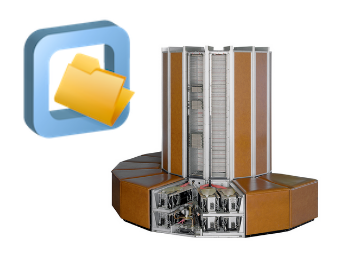

# Best Practices for CernVM-FS in HPC

 

This is an introductory tutorial to [EESSI](https://www.eessi.io/docs/), the European Environment
for Scientific Software Installations,
with a focus on employing it in the context of High-Performance Computing (HPC).

In this tutorial you will learn what EESSI is, how to get access to EESSI,
how to customise EESSI, and how to use EESSI [repositories](appendix/terminology.md#repository)
on HPC infrastructure.

**[Ready to go? Click here to start the tutorial!](eessi/what-is-eessi.md)**

## Recording

Once we have a recording of this tutorial available it will appear here.

### Slides

Once we have slides for this tutorial available they will appear here.

## Intended audience

This tutorial is intended for a general audience who are familiar with running sofware from the command line;
no specific prior knowledge or experience is required.

We expect it to be most valuable to people who are interested in running scientific software on variety of
compute infrastructures.

## Prerequisites

- Basic knowledge of Linux shell environment
- Basic knowledge of Linux file systems
- Familiarity with High-Performance Computing environments is a plus
- Hands-on experience with running scientific software workloads is a plus

## Practical information

### Slack channel

Dedicated channel in EESSI Slack: [`#eessi-tutorial`](https://eessi-hpc.slack.com/archives/C068ACS7XK8)

[Click here to join the EESSI Slack](https://join.slack.com/t/eessi-hpc/shared_invite/zt-1wqy0t8g6-PZJTg3Hjjm5Fm3XEOkzECg)

## MultiXscale

This tutorial was developed and organised in the context of the [MultiXscale EuroHPC
Centre-of-Excellence](https://www.multixscale.eu).

Funded by the European Union. This work has received funding from the [European High Performance Computing Joint
Undertaking (JU)](https://eurohpc-ju.europa.eu) and countries participating in the project under grant agreement No 101093169.

## Contributors

* Bob Dröge (University of Groningen, The Netherlands)
* Kenneth Hoste (Ghent University, Belgium)
* Alan O'Cais (University of Barcelona, Spain; CECAM)
* Lara Peeters (Ghent University, Belgium)
* Thomas Röblitz (University of Bergen, Norway)
* Caspar van Leeuwen (SURF, The Netherlands)

## Additional resources

* TBD
